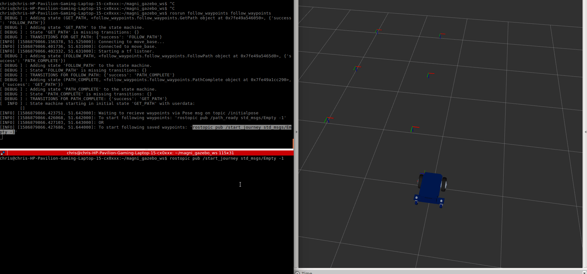

# follow_waypoints [](http://build.ros.org/job/Kbin_uX64__follow_waypoints__ubuntu_xenial_amd64__binary)

A package that will buffer `move_base` goals until instructed to navigate to all waypoints in sequence.


## Installation

```
  $ sudo apt-get install ros-kinetic-follow-waypoints
```

**Documentation on wiki: [http://wiki.ros.org/follow_waypoints](http://wiki.ros.org/follow_waypoints)**

### New features not documented on wiki: 

#### The code can be run in this way:

```
rosrun follow_waypoints follow_waypoints.py
```

#### A wait_duration parameter. This sets wait duration in between waypoints. The default value is set to 0.0 sec.

```
rosparam set wait_duration 5.0
```

#### A distance threshold parameter. Issue the next goal target if the robot reaches within this distance. This has the effect of smoothing motion and not stopping at each waypoint. The default value is set to 0.0 distance which disables the feature.

```
rosparam set waypoint_distance_tolerance 0.5
```

#### Following waypoints will save the list of poses to a file in the following directory:

```
follow_waypoints/saved_path/pose.csv
```

#### To load the previously save path:

```
rostopic pub /start_journey std_msgs/Empty -1
```


